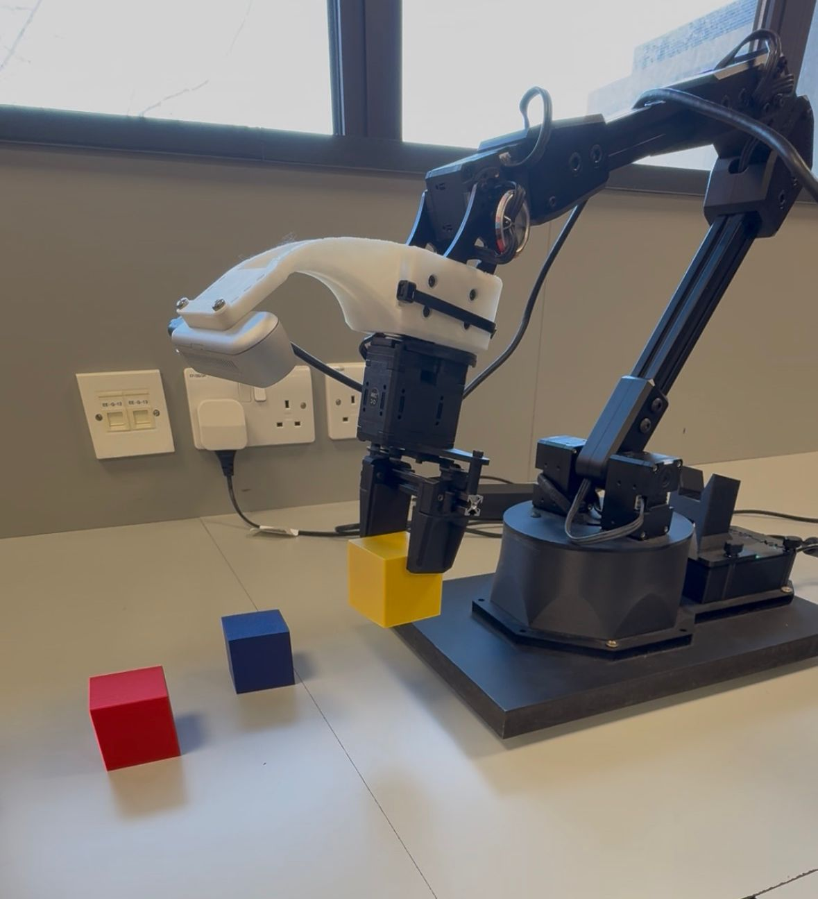
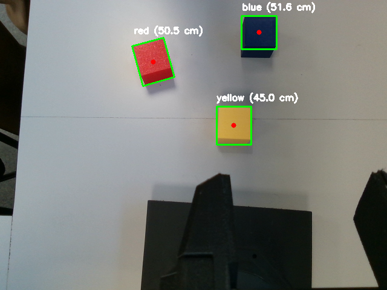
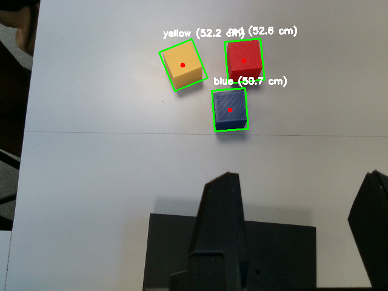
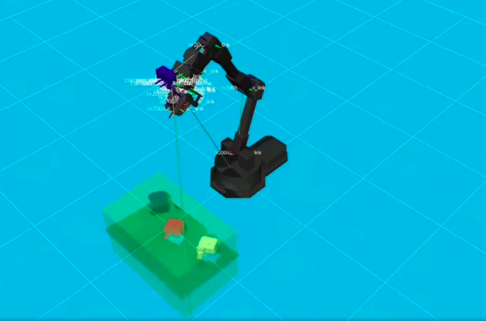
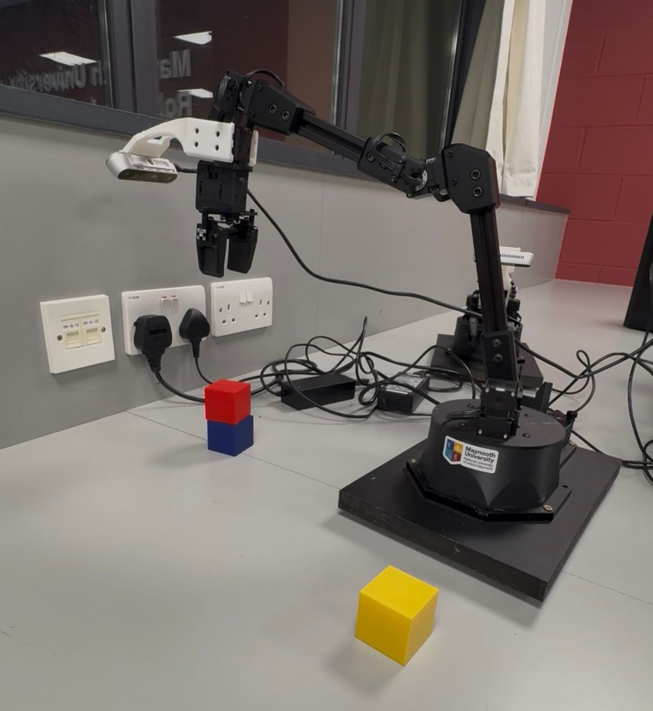

# RX200 Vision-Based Manipulation (ROS2 + MoveIt)

This project implements a vision-based manipulation pipeline for the ReactorX-200 robotic arm using ROS2 and MoveIt.

The system detects colored cubes using a camera and performs autonomous pick-and-place operations. The robot identifies objects in the workspace and executes motion planning to stack them.

---
## Robot Model



---

## 📌 Features

- 🎯 Vision-based cube detection (red, yellow, blue)
- 📷 Real-time camera processing
- 🤖 Autonomous pick-and-place execution
- 🧠 Integration with MoveIt2 for motion planning
- 🖥️ GUI-based control for manual interaction
- 🔄 Works in simulation and real robot setup

---

## 🧠 System Overview

The system consists of three main components:

### 1. Vision Node
- Detects colored cubes from camera input
- Computes object positions

### 2. GUI Publisher
- Allows user interaction via keyboard GUI
- Sends target coordinates

### 3. MoveIt Action Client
- Receives target positions
- Plans and executes robot motion
---

## 📸 Results

### 🧪 Cube Detection (Camera View)

Examples of cube detection using the camera:




---

### 🖥️ RViz Visualization

The detected targets are visualized and executed using MoveIt in RViz:



---

### 🤖 Real Robot Setup

The system running on the real RX200 robotic arm:



---

## ⚙️ Requirements

- ROS2 Humble
- MoveIt2
- Python 3
- Interbotix XSArm packages

---

## 🚀 Installation

Clone the repository and build the workspace:

```bash
git clone https://github.com/YOUR_USERNAME/rx200-vision-manipulation.git
cd rx200-vision-manipulation
colcon build
source install/setup.bash

```

---

## How to Run (Real Robot)

The system requires three terminals running in parallel.

### Terminal 1 — Connect to Robot (MoveIt)

```bash
cd interbotix_ws/
colcon build
source install/setup.bash
ros2 launch interbotix_xsarm_moveit xsarm_moveit.launch.py robot_model:=rx200 hardware_type:=actual
```

This launches the MoveIt interface and connects to the real RX200 robot.

---

### Terminal 2 — Run Vision Node

```bash
colcon build
source install/setup.bash
ros2 run rx200_moveit_control vision
```

This starts the vision pipeline for cube detection.

---

### Terminal 3 — Run GUI

```bash
source install/setup.bash
ros2 run rx200_moveit_control keyboard_gui
```

This launches the GUI used to control and trigger manipulation.

---

**Note:**  
Make sure Terminal 1 (robot connection) is running before starting the vision node and GUI.

--- 


## 📂 Project Structure
```
rx200-vision-manipulation/
│── src/
│ ├── rx200_moveit_control/
│ │ ├── gui_publisher.py
│ │ ├── vision_subscriber.py
│ │ ├── rx200_moveit_action_client.py
│ ├── rx200_xsarm_descriptions/
│
│── images/
│── README.md
│── requirements.txt
│── .gitignore
│── demo_pick_place.mp4
```

--- 

## 📌 Notes

- Use robot_type:=fake for simulation
- Ensure camera is properly calibrated
- Run each node in a separate terminal

---